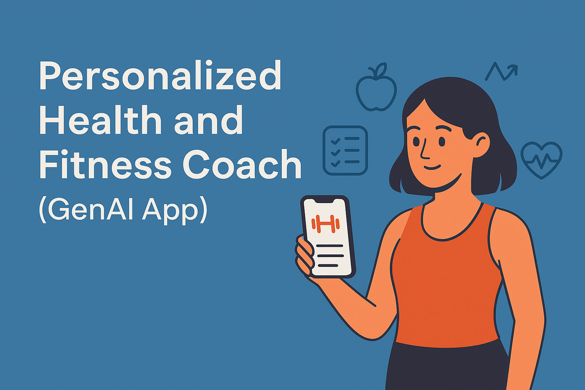

# Personalized Health and Fitness Coach (GenAI App)

A system analysis project focused on designing a GenAI-powered mobile app that delivers customized workout plans, nutrition advice, and wellness recommendations. The project involved requirements gathering, user research, feasibility analysis, and system modeling using UML diagrams and data flow charts.

## Overview

We designed a GenAI-powered health and fitness app that offers:
- Personalized workout plans
- Custom nutrition advice
- Wellness recommendations
- Integration with wearables
- Focus on privacy and real-time user feedback

## Project Documents

- 📄 [Phase 1 - Requirement Analysis](./Phase-1.pdf)
- 📄 [Phase 2 - Functional Design](./Phase-2.pdf)
- 
*A GenAI-powered fitness app project for System Analysis and Design*

## Tools & Concepts

- UML Diagrams (Class, Use Case, Sequence)
- DFDs
- Feasibility Study
- User Story Mapping
- Security & Compliance Requirements
